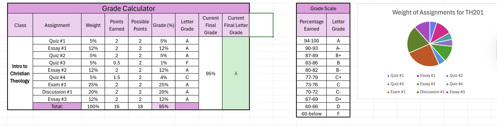
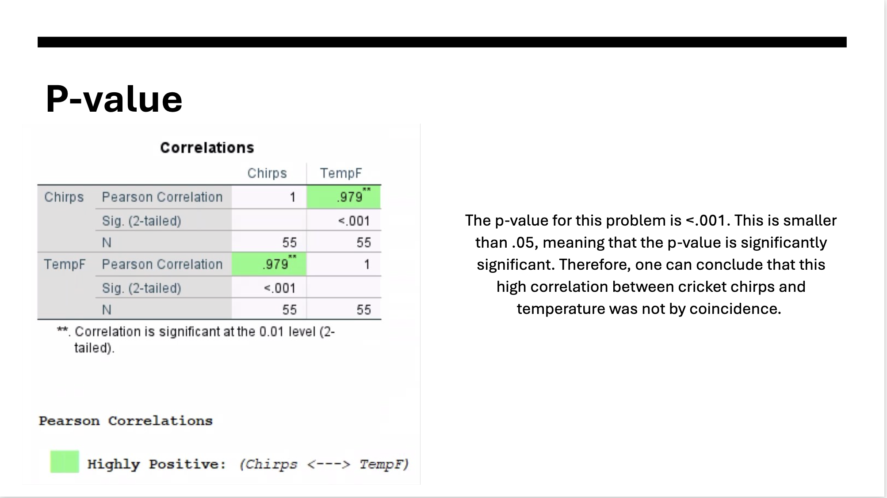

# Erin Costa
Contact Info: (631) 687-7463

## About Me 
Hello! I am an experienced Speech Pathologist and communication disorder professional with over 3 years of proven expertise in speech pathology and communication disorders. 

With skills in linguistics, speech fluency, cognitive-communicative disorders, and aural rehabilitation, I am able to treat communication disorders, and achieve proper communication within patients. I am adept at using Excel, Google Workspace, and Python. 

My proficient skill set, commitment to helping those around me, and passion for social justice make me a valuable asset. In my spare time, I like to do yoga and work on boats. 

You can find me on LinkedIn.
## Education 
BA Speech-Language-Hearing Sciences, Loyola University Maryland

## Projects

### Grade Calculator
 - 
 This project was to make a grade calculator for two of my current classes. Using Excel, I was able to input all of my grades from the semester and how much they are each worth in order to get a predicted value for my final grade. 

#### [Grade Calculator Link](https://studentsloyola-my.sharepoint.com/:x:/g/personal/eecosta_loyola_edu/IQBDx8D5w2l1TadwZYdkGqC8AfW1rfL7hHFT9HOplASllhY?e=FnduwX)
***
### Budget Tracker
 - 
 The objective of this project was to create a budget tracker in Excel. I researched different outboard boats for sale, and used Excel to assess the profit one would make in the buying or selling of these boats. 

#### [Budget Tracker Link](https://studentsloyola-my.sharepoint.com/:x:/g/personal/eecosta_loyola_edu/IQBDx8D5w2l1TadwZYdkGqC8AfW1rfL7hHFT9HOplASllhY?e=Yku2SF)

***
### Correlation
 - 
 Here, I used a given set of data regarding the relationship (or lack thereof) between temperature and the amount of times a cricket chirps. I was able to find that the data was significantly significant because there was a very small p-value. 

 #### [Correlation Link](https://studentsloyola-my.sharepoint.com/:p:/g/personal/eecosta_loyola_edu/IQBO5jQzlHE_TaTPIUmwHFayAS-fy1hdcE-zCtK4CJ0xv2E?e=HTEVXo)
